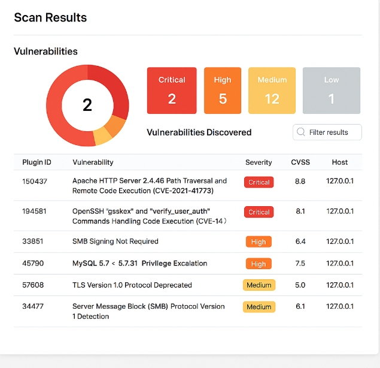

# Install OpenVAS 

## LINUX
OpenVAS comes pre-installed in most Kali images, but here's the full setup:
 Step-by-step:
 1. Update system
<pre>sudo apt update && sudo apt upgrade -y</pre>
 2. Install OpenVAS
<pre>sudo apt install openvas -y</pre>
 3. Initialize OpenVAS
<pre>sudo gvm-setup</pre>
This will take some time. It downloads vulnerability data.

 4. Start OpenVAS services
<pre>
sudo gvm-check-setup
sudo gvm-start

</pre>
 4. Access Web UI
<pre>sudo gvm-manage-certs -a
sudo gvm-cli --gmp-username admin --gmp-password yourpassword
</pre>

# Install Nessus Essentials

## On Windows

Step-by-step:
 1. Download Nessus Essentials

<pre>Go to: https://www.tenable.com/products/nessus/nessus-essentials</pre>
Choose "Windows" and download installer

 2. Run Installer
Double-click the .exe file

Follow prompts to complete installation

 3. Start Nessus Service

It runs as a local service and opens browser:
<pre>https://localhost:8834</pre>

 4. Register Nessus Essentials

Choose "Nessus Essentials"

Enter name/email to get activation code

Paste it when prompted

 5. Download Plugins

Let Nessus download and install plugins (~15-20 min)

6.Create a User Account

Set username/password to log in

 7. Begin Scanning

## Linux
Step-by-step:
 1. Download Nessus .deb Package

<pre>Go to: https://www.tenable.com/downloads/nessus</pre>

Choose Debian/Kali

 2. Install Nessus
<pre>sudo dpkg -i Nessus-*.deb
sudo systemctl start nessusd
sudo systemctl enable nessusd
</pre>

 3. Access Web Interface

Open browser:

<pre>https://localhost:8834</pre>

 4. Register & Activate

Same process as Windows

 5. Wait for Plugin Sync

# Set up scan target as your local machine IP or localhost
1. Find Your Local IP Address
### Kali Linux:
<pre>ip a</pre>
Look for inet under your active network interface (e.g., eth0, wlan0). Example: 192.168.1.100

### Windows:
Open Command Prompt:
<pre>ipconfig</pre>
Find your IPv4 Address under the active network adapter. Example: 192.168.1.50

2. Set Up Scan Target in OpenVAS
🌐 Access OpenVAS Web UI:
Open browser and go to:
<pre>https://localhost:9392</pre>
Steps:
 1. Login to OpenVAS

 2. Go to Configuration > Targets

 3. Click "New Target"

 4. Fill in the details:

   - Name: e.g., "Localhost"

     - Hosts:

      - Use 127.0.0.1 for localhost

     - Or your local IP (e.g., 192.168.1.50)

    - Leave the rest as default or adjust as needed

 5. Click Create

 3. Set Up Scan Target in Nessus Essentials
🌐 Access Nessus Web UI:
  1. Open browser:
<pre>https://localhost:8834</pre>
 Steps:
  2. Login to Nessus

  3. Go to My Scans

  4. Click "New Scan" > Basic Network Scan

  5. Fill in the details:

     -Name: e.g., "Scan Localhost"

     - Targets:

      - 127.0.0.1 (loopback)

      - Or 192.168.x.x (your machine's local IP)

  6. Optional: Adjust scan policy settings

  7. Click Save && start the scan

#  Start a full vulnerability scan
In OpenVAS (Greenbone Vulnerability Management)
🌐 Access Web Interface:
<pre>https://localhost:9392</pre>

 Steps to Start Full Scan:
  1. Login with your OpenVAS credentials.

Go to "Scans" > "Tasks"

  2. Click "New Task"

  3. Fill out the form:

    - Name: e.g., "Full Scan - Localhost"

    - Target: Choose the target you previously created (e.g., 127.0.0.1 or 192.168.x.x)

    - Scan Config: Select Full and fast

  4. Click Create

  5. After it's created, click the play ▶️ icon to start the scan

### Monitor Progress:
The task will change status to Running

- May take 30–60 minutes depending on system size and open services

# Vulnerability Assessment Report

<pre>
| **Metric**               | **Value** |
| ------------------------ | --------- |
| Total Vulnerabilities    | 20        |
| Critical Vulnerabilities | 2         |
| High Vulnerabilities     | 5         |
| Medium Vulnerabilities   | 12         |
| Low/Informational        | 1         |
| Total Ports Open         | 7         |

</pre>

## Top Critical/High Vulnerabilities

  1. Apache HTTP Server Path Traversal Vulnerability
CVE ID: CVE-2021-41773

Severity: Critical (CVSS: 9.8)

Description: Allows remote attackers to gain access to arbitrary files outside the document root.

Affected Service/Port: Apache/2.4.49 on Port 80

Remediation: Update to Apache HTTP Server version 2.4.51 or newer.

  2. OpenSSH User Enumeration
CVE ID: CVE-2023-38408

Severity: High (CVSS: 8.1)

Description: Remote attacker can enumerate valid users via timing discrepancies.

Affected Service/Port: OpenSSH 8.2 on Port 22

Remediation: Upgrade OpenSSH to the latest secure version.

  3. SMB Signing Not Required
CVE ID: N/A (Configuration Issue)

Severity: High (CVSS: 7.5)

Description: SMB server does not enforce message signing, which makes it vulnerable to MITM attacks.

Affected Service/Port: SMB on Port 445

Remediation: Enable SMB signing via system policy or registry setting.

## Open Ports and Services Identified
<pre>
| **Port** | **Service**     | **Description**                    |
| -------- | --------------- | ---------------------------------- |
| 22       | SSH             | OpenSSH 8.2 - secure shell access  |
| 80       | HTTP            | Apache 2.4.49 - vulnerable version |
| 139      | NetBIOS Session | Legacy SMB functionality           |
| 445      | SMB             | File sharing (weak signing config) |
| 3306     | MySQL           | MySQL 5.7 - unencrypted access     |
| 631      | IPP             | Internet Printing Protocol         |
| 8834     | Nessus Web UI   | Secure web access to scanner       |
</pre>

## Recommendations
✅ Patch Apache to a secure version (≥ 2.4.51).

✅ Upgrade OpenSSH to eliminate user enumeration flaws.

✅ Configure SMB Signing to prevent MITM attacks.

✅ Restrict Port Access using a firewall (e.g., UFW or Windows Defender Firewall).

✅ Disable Unused Services, like IPP or NetBIOS if not needed.

